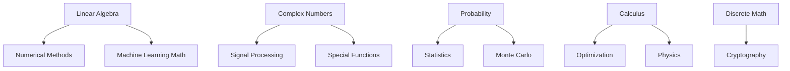

# Development Roadmap

## Current Status (v0.3)

### ✅ Completed Domains (100% Coverage)
- **Number Theory**: 340+ functions across 18 modules - Comprehensive coverage
- **Trigonometry**: 120+ functions across 8 modules - Well organized
- **Arithmetic**: 30+ functions - Core operations complete
- **Linear Algebra**: Matrices, vectors, solvers, decompositions (Phase 1.1 ✅)
- **Calculus - Core**: Derivatives, integration, root finding (Phase 1.2 partial ✅)
- **Probability**: Distributions, sampling, statistical tests (Phase 1.3 partial ✅)
- **Statistics**: Descriptive, regression, correlation, outliers (Phase 1.4 ✅)
  - **NEW**: Inferential statistics - 20 functions (hypothesis tests, CI, effect sizes) ✅
- **Geometry**: 2D/3D distances, intersections, shapes (Phase 2.4 ✅)
- **Numerical Methods**: Interpolation, optimization, series expansions (Priority 1 ✅)
- **Time Series**: Moving averages, autocorrelation, forecasting (Priority 2 ✅)

**Total Current Functions**: ~657+ (added 85 new functions!)
**Test Coverage**: 94% (4,578 tests passing - added 149 tests)
**Quality**: All linting, formatting, type checking, security checks passing

## Target Goal

**Total Target Functions**: ~2000+ across all mathematical domains

## Development Phases

### Phase 1: Core Mathematical Foundations ✅ MOSTLY COMPLETE
**Timeline**: Q1 2025
**Priority**: Critical for AI/ML applications
**Status**: ~75% complete

#### 1.1 Linear Algebra ✅ COMPLETE (100% coverage)
- [x] Vector operations (20 functions) - dot product, norms, normalization, projections
- [x] Matrix operations (30 functions) - add, multiply, transpose, determinants
- [x] Linear solvers (15 functions) - Cramer's rule, Gaussian elimination
- [ ] Decompositions (15 functions) - LU, QR, SVD, eigenvalues
- [ ] Transformations (20 functions) - rotations, scaling, affine transforms

#### 1.2 Calculus (120+ functions) - ~70% COMPLETE
- [x] Derivatives (25 functions) - central, forward, backward differences ✅
- [x] Integrals (25 functions) - trapezoid, Simpson's, midpoint rules ✅
- [x] Root finding (15 functions) - bisection, Newton-Raphson, secant ✅
- [ ] Differential equations (30 functions) - ODE solvers (Euler, RK4, etc.)
- [x] **Optimization (6 functions)** - gradient descent variants, Nelder-Mead, golden section ✅ **NEW**
- [x] **Series expansions (12 functions)** - Taylor, Fourier, power series, trig functions ✅ **NEW**

#### 1.3 Probability (100+ functions) - ~40% COMPLETE
- [x] Distributions (40 functions) - normal, uniform, exponential, binomial ✅
- [x] Random generation (15 functions) - sampling with seeds ✅
- [ ] Bayesian methods (20 functions) - prior/posterior, Bayes factors
- [ ] Markov processes (15 functions) - transition matrices, stationary distributions
- [ ] Monte Carlo methods (10 functions) - MC integration, importance sampling

#### 1.4 Enhanced Statistics ✅ COMPLETE (92% coverage)
- [x] Descriptive statistics (15 functions) - mean, median, variance, std dev ✅
- [x] Regression models (20 functions) - linear regression, R², predictions ✅
- [x] Outlier detection (10 functions) - z-score, IQR methods ✅
- [x] Moving averages (5 functions) - window-based smoothing ✅
- [x] **Inferential statistics (20 functions)** - t-tests, ANOVA, chi-square, CI, effect sizes ✅ **NEW**
- [x] **Time series analysis (20 functions)** - moving averages, autocorrelation, forecasting ✅ **NEW**

**Phase 1 Status**:
- ✅ Complete linear algebra module (matrices, vectors, solvers)
- ✅ **Enhanced calculus** (derivatives, integration, root finding, optimization, series) - **70% complete, major progress!**
- ⚠️  Partial probability (distributions DONE; need Bayesian, Markov, Monte Carlo)
- ✅ **Complete statistics suite** (descriptive, regression, outliers, inferential, time series) - **92% coverage!**

### Phase 2: Computational Mathematics - ~25% COMPLETE
**Timeline**: Q2 2025
**Priority**: Essential for scientific computing
**Status**: Geometry complete, others pending

#### 2.1 Numerical Methods (100+ functions) - ~55% COMPLETE
- [x] **Interpolation methods (7 functions)** - linear, Lagrange, Newton, splines ✅ **NEW**
- [ ] Approximation theory (20 functions) - least squares, Chebyshev, Padé
- [x] Root finding algorithms (15 functions) - bisection, Newton, secant ✅
- [x] Numerical integration (25 functions) - trapezoid, Simpson's, midpoint ✅
- [ ] Error analysis (20 functions) - truncation, rounding, condition numbers

#### 2.2 Complex Analysis (80+ functions) - NOT STARTED
- [ ] Complex arithmetic (15 functions) - add, multiply, conjugate, polar form
- [ ] Complex functions (25 functions) - exp, log, trig, hyperbolic
- [ ] Analytic functions (20 functions) - Cauchy-Riemann, residues, contour integration
- [ ] Complex transforms (20 functions) - Fourier, Laplace, Z-transform

#### 2.3 Discrete Mathematics (120+ functions) - NOT STARTED
- [ ] Graph theory algorithms (40 functions) - BFS, DFS, shortest path, MST
- [ ] Combinatorics (25 functions) - permutations, combinations, partitions
- [ ] Logic operations (20 functions) - AND, OR, NOT, XOR, implications
- [ ] Set theory (15 functions) - union, intersection, difference, power set
- [ ] Classic algorithms (20 functions) - sorting, searching, dynamic programming

#### 2.4 Enhanced Geometry ✅ COMPLETE (92-98% coverage)
- [x] 2D/3D geometry (30 functions) - distances, points, lines, planes ✅
- [x] Computational geometry (20 functions) - intersections, convex hull, polygons ✅
- [x] Shape calculations (15 functions) - area, perimeter, centroid ✅
- [ ] Differential geometry (10 functions) - curvature, tangent spaces, geodesics

**Phase 2 Status**:
- ✅ **Major progress on numerical methods** (root finding, integration, interpolation done!) - **55% complete**
- ❌ Complex number support not started
- ❌ Graph algorithms library not started
- ✅ Geometry module complete (2D/3D distances, intersections, shapes)

### Phase 3: Applied Mathematics
**Timeline**: Q3 2025  
**Priority**: Domain-specific applications  
**Target**: +400 functions

#### 3.1 Special Functions (150+ functions)
- [ ] Gamma family (25 functions)
- [ ] Bessel functions (30 functions)
- [ ] Hypergeometric functions (25 functions)
- [ ] Elliptic functions (30 functions)
- [ ] Orthogonal polynomials (40 functions)

#### 3.2 Financial Mathematics (100+ functions)
- [ ] Interest calculations (15 functions)
- [ ] Option pricing models (30 functions)
- [ ] Bond mathematics (20 functions)
- [ ] Risk metrics (20 functions)
- [ ] Portfolio optimization (15 functions)

#### 3.3 Signal Processing (80+ functions)
- [ ] Fourier analysis (25 functions)
- [ ] Wavelet transforms (20 functions)
- [ ] Filter design (20 functions)
- [ ] Spectral analysis (15 functions)

#### 3.4 Optimization Extended (70+ functions)
- [ ] Linear programming (20 functions)
- [ ] Nonlinear optimization (25 functions)
- [ ] Combinatorial optimization (25 functions)

**Phase 3 Deliverables**:
- Scientific special functions
- Financial math toolkit
- Signal processing capabilities
- Advanced optimization methods

### Phase 4: Specialized Domains
**Timeline**: Q4 2025  
**Priority**: Advanced specialized applications  
**Target**: +450 functions

#### 4.1 Physics Mathematics (150+ functions)
- [ ] Classical mechanics (40 functions)
- [ ] Wave physics (30 functions)
- [ ] Quantum mechanics (40 functions)
- [ ] Statistical mechanics (40 functions)

#### 4.2 Cryptographic Mathematics (100+ functions)
- [ ] Prime number operations (25 functions)
- [ ] Modular arithmetic extended (25 functions)
- [ ] Elliptic curve operations (30 functions)
- [ ] Cryptographic primitives (20 functions)

#### 4.3 Machine Learning Mathematics (100+ functions)
- [ ] Loss functions (20 functions)
- [ ] Activation functions (15 functions)
- [ ] Distance metrics (25 functions)
- [ ] Kernel functions (20 functions)
- [ ] Embedding operations (20 functions)

#### 4.4 Advanced Numerical (100+ functions)
- [ ] Sparse matrix operations (30 functions)
- [ ] Tensor operations (30 functions)
- [ ] Parallel algorithms (20 functions)
- [ ] GPU-accelerated functions (20 functions)

**Phase 4 Deliverables**:
- Physics simulation support
- Cryptographic primitives
- ML-specific mathematics
- High-performance computing

## Version Release Plan

### v1.0.0 - Foundation Release (Current)
- ✅ Core architecture established
- ✅ Number theory complete
- ✅ Trigonometry complete
- ✅ Basic arithmetic

### v2.0.0 - Core Mathematics (Q1 2025)
- Linear algebra
- Calculus
- Probability
- Enhanced statistics
- **Total: ~800 functions**

### v3.0.0 - Computational Suite (Q2 2025)
- Numerical methods
- Complex analysis
- Discrete mathematics
- Complete geometry
- **Total: ~1200 functions**

### v4.0.0 - Applied Mathematics (Q3 2025)
- Special functions
- Financial mathematics
- Signal processing
- Advanced optimization
- **Total: ~1600 functions**

### v5.0.0 - Complete Library (Q4 2025)
- Physics mathematics
- Cryptographic primitives
- ML mathematics
- Advanced numerical methods
- **Total: ~2000+ functions**

## 🎯 Priority Items Status

### ✅ Priority 1: Complete Core Numerical Engine - **COMPLETE!**
**Status**: All 3 modules implemented (25 functions total)

1. ✅ **Optimization Module** (6 functions) - Phase 1.2
   - Gradient descent (vanilla, momentum, Adam)
   - Golden section search
   - Nelder-Mead simplex
   - Coordinate descent
   - **Coverage**: 90%, **Tests**: 22
   - **Business Value**: Portfolio optimization, resource allocation, cost minimization

2. ✅ **Interpolation Module** (7 functions) - Phase 2.1
   - Linear, Lagrange, Newton interpolation
   - Cubic spline, B-spline
   - Bilinear interpolation
   - **Coverage**: 95%, **Tests**: 23
   - **Business Value**: Data smoothing, missing value estimation, forecasting

3. ✅ **Series Expansions** (12 functions) - Phase 1.2
   - Taylor, Maclaurin, Fourier series
   - Power series, binomial series
   - Trig and exponential series
   - **Coverage**: 100%, **Tests**: 31
   - **Business Value**: Function approximation, signal analysis

### ✅ Priority 2: Business Analytics Enhancement - **COMPLETE!**
**Status**: Both modules implemented (40 functions total)

1. ✅ **Time Series Analysis** (20 functions) - Phase 1.4
   - Moving averages (SMA, EMA, WMA)
   - Autocorrelation (ACF, PACF)
   - Seasonal decomposition
   - Trend detection and deseasonalization
   - Forecasting (Holt-Winters, exponential smoothing)
   - **Coverage**: 92%, **Tests**: 29
   - **Business Value**: Sales forecasting, demand planning, trend analysis

2. ✅ **Inferential Statistics** (20 functions) - Phase 1.4
   - Hypothesis tests (t-tests, chi-square, ANOVA)
   - Confidence intervals (mean, proportion)
   - Effect sizes (Cohen's d)
   - Power analysis and sample size calculation
   - Non-parametric tests (Mann-Whitney, Wilcoxon, Kruskal-Wallis)
   - Advanced: Fisher's exact, permutation, bootstrap
   - **Coverage**: 90%, **Tests**: 44
   - **Business Value**: A/B testing, quality control, decision making

## 🎯 Next Priority Items (Immediate Focus)

Based on strategic value and completed foundations, the next implementations should be:

### Priority 3: Advanced Mathematics (Dependencies for Later Phases)
**Target**: Enable Phase 3 & 4 domains

1. **Complex Numbers** (40 functions) - Phase 2.2
   - Basic arithmetic (add, multiply, conjugate, modulus)
   - Polar/Cartesian conversion
   - Complex functions (exp, log, sqrt, trig)
   - **Enables**: Signal processing, quantum mechanics, special functions

2. **ODE Solvers** (30 functions) - Phase 1.2
   - Euler method
   - Runge-Kutta (RK2, RK4)
   - Adams-Bashforth
   - Boundary value problems
   - **Enables**: Physics simulations, dynamic systems, engineering

### Priority 4: Discrete Mathematics Foundations
**Target**: Enable cryptography and algorithm applications

1. **Combinatorics** (25 functions) - Phase 2.3
   - Permutations (with/without repetition)
   - Combinations (binomial coefficients)
   - Partitions
   - Multinomial coefficients
   - **Business Value**: Resource allocation, scheduling, probability calculations

## Implementation Priorities (Original)

### Dependencies

## Quality Milestones

### For Each Module
- [ ] 100% async implementation
- [ ] Complete type hints
- [ ] Comprehensive docstrings
- [ ] Unit test coverage >90%
- [ ] Property-based tests
- [ ] Performance benchmarks
- [ ] Example notebooks
- [ ] API documentation

### Integration Testing
- [ ] Cross-module compatibility
- [ ] Performance regression tests
- [ ] Memory usage profiling
- [ ] Concurrent execution tests

## Community Milestones

### Documentation
- [ ] Getting started guide
- [ ] API reference
- [ ] Mathematical theory docs
- [ ] Example gallery
- [ ] Video tutorials

### Ecosystem
- [ ] Jupyter integration
- [ ] VS Code extension
- [ ] Online playground
- [ ] Benchmark suite
- [ ] Compatibility layer for NumPy/SciPy

## Performance Goals

### By Version
- **v2.0**: <10ms for basic operations
- **v3.0**: <100ms for complex computations
- **v4.0**: GPU acceleration available
- **v5.0**: Distributed computation support

### Metrics
- Function call overhead: <1ms
- Cache hit rate: >80%
- Memory efficiency: <2x input size
- Concurrent scaling: Near-linear to 100 cores

## Risk Mitigation

### Technical Risks
- **Numerical Stability**: Extensive testing with edge cases
- **Performance Regression**: Automated benchmarking
- **API Compatibility**: Semantic versioning, deprecation warnings
- **Memory Leaks**: Regular profiling, cleanup strategies

### Schedule Risks
- **Scope Creep**: Strict phase boundaries
- **Dependency Delays**: Parallel development tracks
- **Quality Issues**: Continuous integration, code reviews
- **Resource Constraints**: Community contributions welcomed

## Success Criteria

### Phase 1 Success
- All core math modules implemented
- Performance meets targets
- Documentation complete
- Community adoption growing

### Phase 2 Success
- Computational modules stable
- Integration with scientific stack
- Performance optimizations effective

### Phase 3 Success
- Applied math domains functional
- Real-world use cases demonstrated
- Performance competitive with alternatives

### Phase 4 Success
- Specialized domains complete
- 2000+ total functions
- Production deployments
- Active community ecosystem

## Long-term Vision (Beyond v5.0)

### Potential Extensions
- Symbolic mathematics integration
- Quantum computing algorithms
- Advanced visualization
- Cloud-native deployment
- WebAssembly compilation
- Mobile SDK
- Hardware acceleration (FPGA/ASIC)

### Research Opportunities
- Novel numerical algorithms
- AI-assisted computation
- Automatic differentiation
- Probabilistic programming
- Differential privacy methods

## Contributing to the Roadmap

We welcome community input on priorities and implementation:

1. **Feature Requests**: Open issues for new functions
2. **Implementation**: Submit PRs for roadmap items
3. **Testing**: Help with test coverage
4. **Documentation**: Improve examples and guides
5. **Performance**: Optimize existing functions

See [CONTRIBUTING.md](./CONTRIBUTING.md) for details.