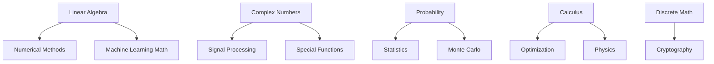

# Development Roadmap

## Current Status (v0.1.0)

### ✅ Completed Domains
- **Number Theory**: 340+ functions across 18 modules - Comprehensive coverage
- **Trigonometry**: 120+ functions across 8 modules - Well organized
- **Arithmetic**: 30+ functions - Basic operations structured

### 📝 Partial Implementation
- **Statistics**: Basic descriptive statistics only
- **Geometry**: Basic 2D shapes only
- **Sequences**: Basic sequence generation
- **Constants**: Mathematical constants

**Total Current Functions**: ~400+

## Target Goal

**Total Target Functions**: ~2000+ across all mathematical domains

## Development Phases

### Phase 1: Core Mathematical Foundations
**Timeline**: Q1 2025  
**Priority**: Critical for AI/ML applications  
**Target**: +400 functions

#### 1.1 Linear Algebra (100+ functions)
- [ ] Vector operations (20 functions)
- [ ] Matrix operations (30 functions)
- [ ] Decompositions (15 functions)
- [ ] Linear solvers (15 functions)
- [ ] Transformations (20 functions)

#### 1.2 Calculus (120+ functions)
- [ ] Derivatives (25 functions)
- [ ] Integrals (25 functions)
- [ ] Differential equations (30 functions)
- [ ] Optimization (20 functions)
- [ ] Series expansions (20 functions)

#### 1.3 Probability (100+ functions)
- [ ] Distributions (40 functions)
- [ ] Random generation (15 functions)
- [ ] Bayesian methods (20 functions)
- [ ] Markov processes (15 functions)
- [ ] Monte Carlo methods (10 functions)

#### 1.4 Enhanced Statistics (80+ functions)
- [ ] Descriptive statistics expansion (15 functions)
- [ ] Inferential statistics (25 functions)
- [ ] Regression models (20 functions)
- [ ] Time series analysis (20 functions)

**Phase 1 Deliverables**:
- Complete linear algebra module
- Full calculus implementation
- Probability distributions and methods
- Professional-grade statistics

### Phase 2: Computational Mathematics
**Timeline**: Q2 2025  
**Priority**: Essential for scientific computing  
**Target**: +350 functions

#### 2.1 Numerical Methods (100+ functions)
- [ ] Interpolation methods (20 functions)
- [ ] Approximation theory (20 functions)
- [ ] Root finding algorithms (15 functions)
- [ ] Numerical integration (25 functions)
- [ ] Error analysis (20 functions)

#### 2.2 Complex Analysis (80+ functions)
- [ ] Complex arithmetic (15 functions)
- [ ] Complex functions (25 functions)
- [ ] Analytic functions (20 functions)
- [ ] Complex transforms (20 functions)

#### 2.3 Discrete Mathematics (120+ functions)
- [ ] Graph theory algorithms (40 functions)
- [ ] Combinatorics (25 functions)
- [ ] Logic operations (20 functions)
- [ ] Set theory (15 functions)
- [ ] Classic algorithms (20 functions)

#### 2.4 Enhanced Geometry (50+ functions)
- [ ] 3D geometry (20 functions)
- [ ] Computational geometry (20 functions)
- [ ] Differential geometry (10 functions)

**Phase 2 Deliverables**:
- Numerical computing toolkit
- Complex number support
- Graph algorithms library
- Complete geometry module

### Phase 3: Applied Mathematics
**Timeline**: Q3 2025  
**Priority**: Domain-specific applications  
**Target**: +400 functions

#### 3.1 Special Functions (150+ functions)
- [ ] Gamma family (25 functions)
- [ ] Bessel functions (30 functions)
- [ ] Hypergeometric functions (25 functions)
- [ ] Elliptic functions (30 functions)
- [ ] Orthogonal polynomials (40 functions)

#### 3.2 Financial Mathematics (100+ functions)
- [ ] Interest calculations (15 functions)
- [ ] Option pricing models (30 functions)
- [ ] Bond mathematics (20 functions)
- [ ] Risk metrics (20 functions)
- [ ] Portfolio optimization (15 functions)

#### 3.3 Signal Processing (80+ functions)
- [ ] Fourier analysis (25 functions)
- [ ] Wavelet transforms (20 functions)
- [ ] Filter design (20 functions)
- [ ] Spectral analysis (15 functions)

#### 3.4 Optimization Extended (70+ functions)
- [ ] Linear programming (20 functions)
- [ ] Nonlinear optimization (25 functions)
- [ ] Combinatorial optimization (25 functions)

**Phase 3 Deliverables**:
- Scientific special functions
- Financial math toolkit
- Signal processing capabilities
- Advanced optimization methods

### Phase 4: Specialized Domains
**Timeline**: Q4 2025  
**Priority**: Advanced specialized applications  
**Target**: +450 functions

#### 4.1 Physics Mathematics (150+ functions)
- [ ] Classical mechanics (40 functions)
- [ ] Wave physics (30 functions)
- [ ] Quantum mechanics (40 functions)
- [ ] Statistical mechanics (40 functions)

#### 4.2 Cryptographic Mathematics (100+ functions)
- [ ] Prime number operations (25 functions)
- [ ] Modular arithmetic extended (25 functions)
- [ ] Elliptic curve operations (30 functions)
- [ ] Cryptographic primitives (20 functions)

#### 4.3 Machine Learning Mathematics (100+ functions)
- [ ] Loss functions (20 functions)
- [ ] Activation functions (15 functions)
- [ ] Distance metrics (25 functions)
- [ ] Kernel functions (20 functions)
- [ ] Embedding operations (20 functions)

#### 4.4 Advanced Numerical (100+ functions)
- [ ] Sparse matrix operations (30 functions)
- [ ] Tensor operations (30 functions)
- [ ] Parallel algorithms (20 functions)
- [ ] GPU-accelerated functions (20 functions)

**Phase 4 Deliverables**:
- Physics simulation support
- Cryptographic primitives
- ML-specific mathematics
- High-performance computing

## Version Release Plan

### v1.0.0 - Foundation Release (Current)
- ✅ Core architecture established
- ✅ Number theory complete
- ✅ Trigonometry complete
- ✅ Basic arithmetic

### v2.0.0 - Core Mathematics (Q1 2025)
- Linear algebra
- Calculus
- Probability
- Enhanced statistics
- **Total: ~800 functions**

### v3.0.0 - Computational Suite (Q2 2025)
- Numerical methods
- Complex analysis
- Discrete mathematics
- Complete geometry
- **Total: ~1200 functions**

### v4.0.0 - Applied Mathematics (Q3 2025)
- Special functions
- Financial mathematics
- Signal processing
- Advanced optimization
- **Total: ~1600 functions**

### v5.0.0 - Complete Library (Q4 2025)
- Physics mathematics
- Cryptographic primitives
- ML mathematics
- Advanced numerical methods
- **Total: ~2000+ functions**

## Implementation Priorities

### Critical Path Items
1. **Linear Algebra** - Blocks many other modules
2. **Probability Distributions** - Core for statistics/ML
3. **Numerical Methods** - Foundation for computational math
4. **Complex Numbers** - Required for signal processing

### Quick Wins
1. **Complete Statistics Module** - Partially implemented
2. **Expand Geometry** - Build on existing base
3. **Basic Calculus** - High demand functions
4. **Common Special Functions** - Gamma, Beta, Erf

### Dependencies

## Quality Milestones

### For Each Module
- [ ] 100% async implementation
- [ ] Complete type hints
- [ ] Comprehensive docstrings
- [ ] Unit test coverage >90%
- [ ] Property-based tests
- [ ] Performance benchmarks
- [ ] Example notebooks
- [ ] API documentation

### Integration Testing
- [ ] Cross-module compatibility
- [ ] Performance regression tests
- [ ] Memory usage profiling
- [ ] Concurrent execution tests

## Community Milestones

### Documentation
- [ ] Getting started guide
- [ ] API reference
- [ ] Mathematical theory docs
- [ ] Example gallery
- [ ] Video tutorials

### Ecosystem
- [ ] Jupyter integration
- [ ] VS Code extension
- [ ] Online playground
- [ ] Benchmark suite
- [ ] Compatibility layer for NumPy/SciPy

## Performance Goals

### By Version
- **v2.0**: <10ms for basic operations
- **v3.0**: <100ms for complex computations
- **v4.0**: GPU acceleration available
- **v5.0**: Distributed computation support

### Metrics
- Function call overhead: <1ms
- Cache hit rate: >80%
- Memory efficiency: <2x input size
- Concurrent scaling: Near-linear to 100 cores

## Risk Mitigation

### Technical Risks
- **Numerical Stability**: Extensive testing with edge cases
- **Performance Regression**: Automated benchmarking
- **API Compatibility**: Semantic versioning, deprecation warnings
- **Memory Leaks**: Regular profiling, cleanup strategies

### Schedule Risks
- **Scope Creep**: Strict phase boundaries
- **Dependency Delays**: Parallel development tracks
- **Quality Issues**: Continuous integration, code reviews
- **Resource Constraints**: Community contributions welcomed

## Success Criteria

### Phase 1 Success
- All core math modules implemented
- Performance meets targets
- Documentation complete
- Community adoption growing

### Phase 2 Success
- Computational modules stable
- Integration with scientific stack
- Performance optimizations effective

### Phase 3 Success
- Applied math domains functional
- Real-world use cases demonstrated
- Performance competitive with alternatives

### Phase 4 Success
- Specialized domains complete
- 2000+ total functions
- Production deployments
- Active community ecosystem

## Long-term Vision (Beyond v5.0)

### Potential Extensions
- Symbolic mathematics integration
- Quantum computing algorithms
- Advanced visualization
- Cloud-native deployment
- WebAssembly compilation
- Mobile SDK
- Hardware acceleration (FPGA/ASIC)

### Research Opportunities
- Novel numerical algorithms
- AI-assisted computation
- Automatic differentiation
- Probabilistic programming
- Differential privacy methods

## Contributing to the Roadmap

We welcome community input on priorities and implementation:

1. **Feature Requests**: Open issues for new functions
2. **Implementation**: Submit PRs for roadmap items
3. **Testing**: Help with test coverage
4. **Documentation**: Improve examples and guides
5. **Performance**: Optimize existing functions

See [CONTRIBUTING.md](./CONTRIBUTING.md) for details.